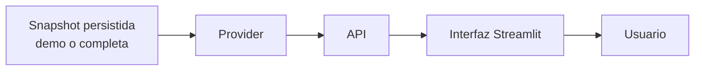

# Sistema explicable de recomendación táctica en tenis

Sistema que recomienda, a partir de datos profesionales de tenis registrados
punto a punto, en qué oportunidad táctica un jugador tiene más margen de
mejora frente a un rival concreto. Está pensado para jugadores y
entrenadores que preparan un partido. Utiliza el historial de enfrentamientos
disponible hasta una fecha de corte elegida por el usuario y produce
recomendaciones **descriptivas y explicables**: cada recomendación se
acompaña de la evidencia histórica que la respalda (tasa de éxito, intervalo
de confianza y tamaño de muestra), y el sistema se abstiene explícitamente
cuando esa evidencia es insuficiente en lugar de forzar una respuesta. El
sistema **no predice ni garantiza el resultado de un partido**: describe
patrones observados en el historial, no causas ni resultados futuros.

## Qué recomienda

El sistema evalúa cuatro oportunidades tácticas del primer saque y del
primer resto, y prioriza cuál de ellas presenta el patrón histórico más
claro para el enfrentamiento consultado:

- **Dirección del primer saque** — a qué lado se dirige el saque (abierto,
  al cuerpo o a la T) *(identificador interno: P02)*.
- **Dirección lateral del primer resto** — hacia qué lado de la pista
  responde el resto *(P04)*.
- **Profundidad del primer resto** — qué tan profundo llega el resto en la
  pista del rival *(P05)*.
- **Tipo de golpe del primer resto** — con qué golpe se ejecuta el resto
  *(P06)*.

Para cada oportunidad disponible, la recomendación incluye la evidencia
histórica (tamaño de muestra e intervalo de confianza) que la respalda. Si
el historial entre ese jugador y ese rival hasta la fecha de corte no
alcanza el mínimo de evidencia necesario, el sistema se abstiene en lugar de
recomendar con baja confianza.

La interfaz guía la selección en tres pasos (jugador → rival → fecha de
corte), y solo permite elegir combinaciones que existen en los datos
disponibles.


## Demostración reproducible

El repositorio incluye una snapshot de demostración —
[`demo/tactical-recommendations-demo-v1.json`](demo/tactical-recommendations-demo-v1.json)
— generada de forma **sintética y determinista**: no contiene ningún dato
privado ni real. Incluye varios jugadores y rivales de fantasía, varias
fechas de corte válidas por enfrentamiento, y permite probar la API, la
interfaz y Docker de extremo a extremo sin acceso a ningún dato privado.
Puede regenerarse en cualquier momento (ver
["Regeneración de la demostración"](#regeneración-de-la-demostración)).

Instrucciones desde un clon limpio:

### Windows (PowerShell)

```powershell
git clone https://github.com/errandi02/tennis-strategy-recommender.git
Set-Location tennis-strategy-recommender

py -3.12 -m venv .venv
Set-ExecutionPolicy -Scope Process -ExecutionPolicy Bypass
.\.venv\Scripts\Activate.ps1

python -m pip install --upgrade pip
python -m pip install -r requirements.txt

.\scripts\run_demo.ps1
```

### macOS/Linux

```bash
git clone https://github.com/errandi02/tennis-strategy-recommender.git
cd tennis-strategy-recommender

python3.12 -m venv .venv
source .venv/bin/activate

python -m pip install --upgrade pip
python -m pip install -r requirements.txt

./scripts/run_demo.sh
```

Ambos scripts generan la snapshot demo si aún no existe, arrancan la API y
la interfaz, y esperan a que la API responda antes de abrir la interfaz.

- Interfaz: <http://127.0.0.1:8501>
- Estado de la API: <http://127.0.0.1:8000/healthz>
- Para detener: `Ctrl+C` en la misma terminal.

## Docker Compose

La misma demostración puede levantarse en contenedores con el
`docker-compose.yml` del repositorio, usando la snapshot demo como origen.

### PowerShell (Windows)

```powershell
$env:TENNIS_TACTICAL_SNAPSHOT_HOST_PATH = (
  Resolve-Path '.\demo\tactical-recommendations-demo-v1.json'
).Path

docker compose config
docker compose up -d --build
docker compose ps
```

### POSIX (macOS/Linux)

```bash
export TENNIS_TACTICAL_SNAPSHOT_HOST_PATH="$PWD/demo/tactical-recommendations-demo-v1.json"

docker compose config
docker compose up -d --build
docker compose ps
```

- Interfaz: <http://127.0.0.1:8501> (único puerto publicado al host).
- La API se ejecuta exclusivamente en la red interna de Docker; nunca
  publica un puerto al host.
- Para cerrar sin dejar residuos: `docker compose down --remove-orphans`.

## Cómo obtener y reproducir los datos originales

Esta sección distingue explícitamente cuatro niveles de datos y documenta,
para cada uno, solo comandos que existen realmente en este repositorio.

**A. Datos fuente públicos originales.** Los datos punto a punto proceden
del [Match Charting Project de Jeff
Sackmann](https://github.com/JeffSackmann/tennis_MatchChartingProject),
fijado al commit `2c59eef194967e688b69e73df344184a06322cd8` (cuyo mensaje
de commit referencia datos hasta el 25 de mayo de 2026). Los cuatro
archivos CSV utilizados, en la raíz de ese repositorio, son:
`charting-m-matches.csv`, `charting-m-points-to-2009.csv`,
`charting-m-points-2010s.csv` y `charting-m-points-2020s.csv`.

Para obtenerlos y verificar que se usa el commit correcto:

```bash
git clone https://github.com/JeffSackmann/tennis_MatchChartingProject.git
cd tennis_MatchChartingProject
git checkout 2c59eef194967e688b69e73df344184a06322cd8
git rev-parse HEAD   # debe imprimir 2c59eef194967e688b69e73df344184a06322cd8
```

Copia esos cuatro CSV a `data/raw/match_charting_project/` dentro de este
repositorio (esa ruta está excluida de Git por `.gitignore`; nunca se sube).

**B. Parquet procesado (`points_enriched.parquet`).** Con los cuatro CSV en
su sitio, este repositorio incluye los scripts reales que los auditan y
limpian:

```bash
python -m src.data.inventory   # auditoría opcional de los CSV crudos -> reports/data_inventory.json
python -m src.data.clean_data  # produce data/processed/matches_clean.parquet y data/processed/points_enriched.parquet
```

`src/data/clean_data.py` valida superficies, fechas y duplicados, aplica
correcciones de metadatos documentadas en `src/data/quality_rules.py`, y
escribe un informe de limpieza en `reports/cleaning_report.json`. Según las
constantes de contrato ya versionadas en
`src/analysis/tactical_recommender_pipeline.py`, el conjunto esperado tras
esta etapa es del orden de 7.524 partidos y 1.280.408 filas de punto (fechas
1960-2026).

**C. Snapshot completa (uso interno, no incluida en Git).** La snapshot
completa se construye ejecutando el pipeline descriptivo P10
(`src/analysis/tactical_recommender_pipeline.py`) sobre
`points_enriched.parquet`, y proyectando su resultado al formato de
snapshot persistida mediante el generador offline P14
(`src/analysis/tactical_recommendation_snapshot_generator.py`). **Aviso de
transparencia:** la ejecución real de ese pipeline está protegida por una
autorización de ejecución única ya cerrada en el propio código
(`REAL_EXECUTION_AUTHORIZED = False`, `REAL_EXECUTION_ATTEMPTS = 2`,
`REAL_EXECUTION_BLOCK_REASON = "real_execution_completed_no_further_execution_authorized"`)
— fue ejecutado sobre el conjunto real dos veces durante el desarrollo y no
existe actualmente un comando público que vuelva a ejecutarlo. El
repositorio permite reproducir inmediatamente el producto mediante la
snapshot demo (sección anterior). La reconstrucción completa desde los
datos fuente requiere ejecutar las etapas offline documentadas por
separado, y su etapa final no está disponible para una nueva ejecución
pública.

**D. Snapshot demo incluida.** [`demo/tactical-recommendations-demo-v1.json`](demo/tactical-recommendations-demo-v1.json)
es la única snapshot que este repositorio distribuye: 100% sintética,
generada en memoria por [`scripts/generate_demo_snapshot.py`](scripts/generate_demo_snapshot.py)
reutilizando el mismo código de producción que las etapas A-C, sin leer
nunca datos reales. Ver ["Regeneración de la demostración"](#regeneración-de-la-demostración).

**Qué no se incluye en Git**: los CSV originales, `matches_clean.parquet`,
`points_enriched.parquet`, cualquier snapshot generada a partir de datos
reales, y los resultados del periodo de test sellado 2024-2026. Todos están
excluidos por `.gitignore`/`.dockerignore` y nunca se han subido a este
repositorio.

## Arquitectura



- La interfaz **no recalcula** ninguna estadística ni ejecuta análisis: solo
  presenta lo que la API le devuelve.
- La API sirve recomendaciones **ya calculadas y persistidas** en una
  snapshot; no accede a datos punto a punto en tiempo de petición.
- La snapshot completa (construida a partir de datos reales) **nunca se
  versiona en Git** y solo vive en el entorno del operador.
- La snapshot demo incluida en el repositorio es sintética y permite
  reproducir el producto completo (API + interfaz + Docker) sin ningún dato
  real.

## Regeneración de la demostración

```bash
python scripts/generate_demo_snapshot.py
```

El generador es determinista: dos ejecuciones producen bytes idénticos.
El archivo resultante debe conservar exactamente este hash SHA-256:

```
93daf1943e10d5de6eb2e30c6671b2998882cf184e43ea9847c256368261be69
```

## Tests

```bash
python -m pytest -q
python -m compileall -q src tests scripts
python -m pip check
git diff --check
```

Algunos tests de infraestructura Docker requieren el binario `docker`
disponible en `PATH` y se omiten automáticamente si no lo está.

## Privacidad y limitaciones

- Los datos punto a punto completos y la snapshot generada a partir de
  ellos **no están en Git**; solo la snapshot demo sintética se distribuye.
- La demostración incluida es enteramente sintética: no expone puntos ni
  partidos individuales reales.
- Las recomendaciones son **descriptivas**, basadas en frecuencias
  históricas observadas — no estiman efectos causales ni garantizan
  resultados.
- La cobertura de cada recomendación depende del historial disponible entre
  ese jugador y ese rival hasta la fecha de corte elegida.
- El sistema se abstiene explícitamente cuando la evidencia histórica es
  insuficiente, en lugar de recomendar con baja confianza.

## Documentación adicional

El historial técnico completo de desarrollo — decisiones de diseño,
contratos internos y validaciones fase a fase — está en
[`docs/DEVELOPMENT_AND_VALIDATION_HISTORY.md`](docs/DEVELOPMENT_AND_VALIDATION_HISTORY.md).
